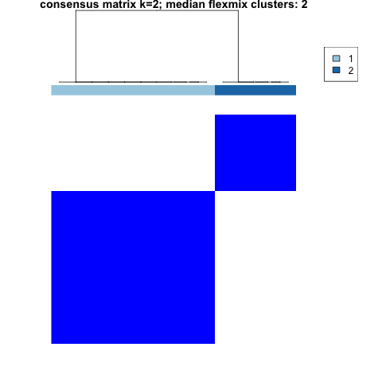

# longmixr

<!-- badges: start -->
[](https://github.com/cellmapslab/longmixr/actions)
[](https://CRAN.R-project.org/package=longmixr)
<!-- badges: end -->

The goal of longmixr is to provide consensus clustering for longitudinal clustering
performed with [`flexmix`](https://cran.r-project.org/package=flexmix). It uses the approach from [`ConsensusClusterPlus`](https://bioconductor.org/packages/release/bioc/html/ConsensusClusterPlus.html) but
replaces the clustering of the longitudinal data with a `flexmix` model.

## Installation
You can install longmixr from CRAN with:

``` r
install.packages("longmixr")
```

You can install the latest version from github with:

``` r
remotes::install_github("cellmapslab/longmixr")
```

If you want to render the vignette, use:

``` r
remotes::install_github("cellmapslab/longmixr", build_vignettes = TRUE, dependencies = TRUE)
```

Please note that for the vignette a lot more dependencies are installed.

## Basic usage
You need a dataset with a column that identifies the subject, a column that
denotes the time point of the measurement and variables that you want to model.

``` r
set.seed(5)
test_data <- data.frame(
  patient_id = rep(1:10, each = 4),
  visit = rep(1:4, 10),
  var_1 = c(rnorm(20, -1), rnorm(20, 3)) + rep(seq(from = 0, to = 1.5, length.out = 4), 10),
  var_2 = c(rnorm(20, 0.5, 1.5), rnorm(20, -2, 0.3)) + rep(seq(from = 1.5, to = 0, length.out = 4), 10)
)
```

In the following approach, the variables `var_1` and `var_2` each are modeled as
dependent on a smooth function of time, taking the multiple measurements for each
subject into account. The assumption is that `var_1` and `var_2` represent a
multivariate outcome. The modeling is specified in the `flexmix` drivers
and the `flexmix_formula`:

``` r
model_list <- list(flexmix::FLXMRmgcv(as.formula("var_1 ~ .")),
                   flexmix::FLXMRmgcv(as.formula("var_2 ~ .")))
clustering <- longitudinal_consensus_cluster(
  data = test_data,
  id_column = "patient_id",
  max_k = 2,
  reps = 3,
  model_list = model_list,
  flexmix_formula = as.formula("~s(visit, k = 4) | patient_id"))
```

The results of the clustering can be assessed via several plots. For every
specified number of clusters, the consensus matrix and the resulting hierarchical
clustering on this matrix is shown. Additionally, the consensus CDF and the delta
Area plots give a measure which number of cluster is optimal. The tracking plot
gives an overview how the observations are distributed across the different clusters
for different numbers of specified clusters. The item (subject) consensus
plot shows the average consensus of each subject with all other subjects that
belong to one cluster. The cluster consensus plot depicts the average consensus
between all members of each cluster.

The above mentioned plots are generated when calling the `plot` function:

``` r
plot(clustering)
```

You can also select which plots you want to generate:

``` r
plot(clustering, which_plots = "consensusmatrix_2")
```



### Detailed explanation
For a detailed explanation how you can use `longmixr` to analyze your
longitudinal data, check out the
[Example clustering analysis vignette](https://cellmapslab.github.io/longmixr/articles/analysis_workflow.html).

## Cross-sectional clustering
Additionally, this package provides a wrapper function around the
`ConsensusClusterPlus` function to work with mixed continuous and categorical
data (by using the Gower distance):

``` r
dc <- mtcars
# scale continuous variables
dc <- sapply(mtcars[, 1:7], scale)
# code factor variables
dc <- cbind(as.data.frame(dc),
            vs = as.factor(mtcars$vs),
            am = as.factor(mtcars$am),
            gear = as.factor(mtcars$gear),
            carb = as.factor(mtcars$carb))
cc <- crosssectional_consensus_cluster(
  data = dc,
  reps = 10,
  seed = 1
)
```

## Copyright
The package is based on the code of [`ConsensusClusterPlus`](https://bioconductor.org/packages/release/bioc/html/ConsensusClusterPlus.html)
(version 1.52.0). For this code the copyright holders are Matt Wilkerson and
Peter Waltman. For all subsequent changes the copyright holder is the Max Planck
Institute of Psychiatry. The code is licensed under GPL v2.
